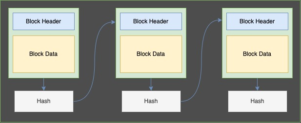

# Blockchain Learning

## Basics Of Blockchain

### Introduction

The blockchain can be seen as a type of data structure which stores data in blocks and each block is related to its next block with the help of its hash value. All of the data of blockchain is stored on multiple nodes(a computer machine or a server) instead of a single central database. Each node agrees on the data that is stored on them and be in sync with each other with the help of a consensus mechanism.

### What is a Block ?

Before starting to learn about what blockchain is let us first understand What a "block" is. A **block** is a just a bunch of data, a collection of records or a records of transactions stored in a container which we call block.

For the Bitcoin blockchain, this data is just a list of transactions saying:  
_X Pays Y $50_  
_A Pays B $40_  
_C Pays D $200_  
and so on.

For the Ethereum blockchain, this data is also a list of transactions, the transactions are not only for sending currency or **value** (ETH in this case) but also for the interactions with the smart contract code which runs on Ethereum Virtual Machine (EVM). You can learn about the EVM and the smart contracts on the ethereum basics branch.

To visualize what a Block is you can check [this](https://andersbrownworth.com/blockchain/block) out. To see the bitcoin block click [here](https://www.blockchain.com/btc/block/00000000000000000003a79ab7cb64861884754adea7b5385651ba3c037f893c) and to see the ethereum block click [here](https://etherscan.io/block/14870857).

So, the blockchain can be seen as a type of data structure which stores data related to value transfers or smart contract function calls or any other data into a block. Storing a lot of data in a single block is not efficient, the blocks in the blockchain have limit over how much data they can store, because of this reason there is more than one block in a blockchain.

### Anatomy of a Block

A block is divided into 2 parts:

1. Block Header, contains information related to the block.
2. Block Data, contains information related to all the transactions.

- **Block Number** also known as the block height, is the number of block.
- **Previous Block Hash** is the hash of the previous block, it will be zero in case of the **Genesis Block** the very first block of the blockchain.
- **The Merkle Tree Root Hash** is the hash of all the transaction's hash combined together. We will go through Merkle Tree section later.
- **Nonce** is the unique identifier of the block.
- **Block Difficulty** is the measure of how hard it is to mine the block.
- **Timestamp** is the time in seconds. It tells when the block mined and added to the chain.
- **Transactions** are the part of Block Data, it is the collection of all the transactions that were included in the blocks.

### How are Blocks chained together ?

The blocks in the blockchain are chained together by storing the hash of their previous block in their block header. To visualize it you can look in the image below. You can also play with [this]() interactive blockchain visualization.

### Transactions in blockchain

If we talk about bitcoin, the transactions are used to spend satoshis (smallest unit of bitcoin, 1 Bitcoin = 100000000 Satoshis). In case of Ethereum the transactions are used to spend wei (smallest unit of ether, 1 Ether = 1000000000000000000 Wei (18 zeroes)) and also to interact with the smart contracts. We can think of transactions as signed piece of information which is added to the block. Transactions move the blockchain from one state to another state.

The transction is signed by the sender to validate that it is actually sent by the sender. This is where the Public-key cryptography comes into play, this cryptography is also known as Asymmetric key cryptography.

The transactions on a Bitcoin network are different from that on an Ethereum network because the Bitcoin blockchain follows **Unspent Transaction Output(UTXO)** model and Ethereum blockchain follows the **accounts model**
